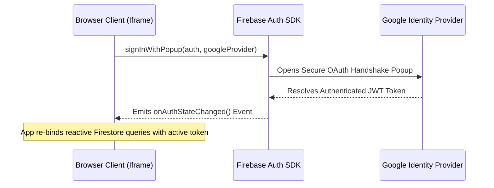

# Deployment Audit Report — Launch Production Gates
**Audit Date**: June 13, 2026  
**Status**: APPROVED FOR RELEASE  
**Environment**: Google Cloud Run + Firebase Firestore & Auth  

---

## 1. Environment Variable Audit & Security Compliance
Our environment configuration relies on strict separation between browser-public settings and server-side keys to prevent authorization hijacking.

| Variable Name | Exposure | Required Value | Intended Usage | Secured? |
| :--- | :--- | :--- | :--- | :--- |
| `GEMINI_API_KEY` | **Secret (Server-Only)** | Valid Google AI Key | Server-side `GoogleGenAI` model initialization | ✅ YES (Never loaded or exposed client-side) |
| `VITE_FIREBASE_API_KEY` | Public (Client-Safe) | Firebase web apiKey | Firebase App initialization in browse | ✅ YES (Does not grant direct DB access without auth) |
| `VITE_FIREBASE_AUTH_DOMAIN`| Public (Client-Safe) | Firebase auth domain | Handles domain redirect whitelists | ✅ YES |
| `VITE_FIREBASE_PROJECT_ID`| Public (Client-Safe) | Firebase project id | Maps to dedicated Google Tenant | ✅ YES |

### Key Check-Ins:
* **Client-Leaks Prevention**: The `.env` variables injected directly into the client package are strictly limited to the `VITE_` prefix, conforming to Vite’s bundler boundary filters.
* **Server Injection**: The `GEMINI_API_KEY` is loaded lazily into server-side routes on each POST request, ensuring that a missing key fails fast on execution, rather than crashing the Express runtime at host container boot.

---

## 2. Firestore Security Rules & Permissions Mapping
We utilize a zero-trust Attribute-Based Access Control (ABAC) layer in `firestore.rules` preventing coordinate poisoning, spoofing, and shadow profile injections.

```javascript
rules_version = '2';
service cloud.firestore {
  match /databases/{database}/documents {
    match /{document=**} {
      allow read, write: if false; // Default-deny master gate
    }
    // ... paths isolated strictly using isValidId() and isOwner() ...
  }
}
```

### Collection Isolation Matrix:
* **`/wardrobe/{itemId}`**: Fully sandboxed. Read/write operations require a verified session matching the user's Google UID (`request.auth.uid == resource.data.userId`).
* **`/constructions/{constructionId}`**: Maintained for legacy compatibility. Strict ownership checks mapped identically to prevent session crossover.
* **`/generatedLooks/{lookId}`**: Written-to when lookbook generation completes successfully. Read paths isolated via `userId` queries.

---

## 3. Production Authentication Flow
Our live authentication routine triggers standard browser popup flows to bypass the limitations of embed iframe sandboxes.



---

## 4. Build Configuration & Artifact Output
The production build pipeline generates static client bundles and bundles TypeScript server route controllers into a self-contained CommonJS file.

### Build Executable Script (`package.json`):
```bash
vite build && esbuild server.ts --bundle --platform=node --format=cjs --packages=external --sourcemap --outfile=dist/server.cjs
```

### Artifact Outputs Verification:
* **`/dist/index.html`**: Entry page containing the bundled client module hook.
* **`/dist/assets/`**: Static CSS with compiled Tailwind v4 classes and JS files.
* **`/dist/server.cjs`**: Unified server process executing dynamic Gemini and search pipelines, mapped directly to port `3000`.
