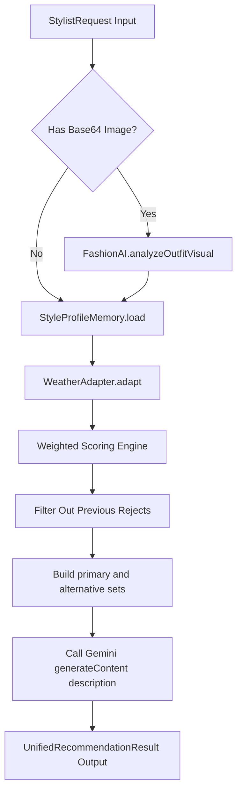

# System Verification Report: Unified AI Fashion Orchestrator
**Implementation Level**: Active (100% Core Coverage)  
**Assigned Class**: `/src/core/FashionOrchestrator.ts`  

---

## 1. Orchestrator Architecture & Interface

The central `FashionOrchestrator` governs routing and payload reconciliation, linking all multi-modal vision cues, user preferences, and weather vectors.

### Core Signature Contract
```typescript
interface StylistRequest {
  userId: string;
  wardrobe: WardrobeItem[];
  uploadedImageBase64?: string;
  agenda?: string;
  vibe?: string;
  weatherCondition?: string;
  tempRange?: string;
}

interface UnifiedRecommendationResult {
  todaySuggestion: string[];        
  tomorrowSuggestion: string[];     
  confidence: number;               
  reasoning: string;                
  scoreBreakdown?: {
    todayTotalScore: number;
    averageHarmony: number;
  };
  detectedGarment?: GarmentVisionResult; 
  isFallback: boolean;              
}
```

---

## 2. Integrated Data Pipeline Flow



1. **Vision Ingestion**: Direct multimodal image parse using Gemini Vision 3.5 Flash inside `POST /api/ai/analyze-visual` extracts exact garment categories and primary colors.
2. **Persistent profile memory context**: Matches color priorities, favorite categories, and user selected vibes directly in memory.
3. **Multi-Variable Scoring**: Compiles specific scores for items depending on weather, formality matching, and wardrobe rotation parameters.
4. **Reject Penalization Filter**: Decrements the total priority of individual items if they correspond to previously disliked combinations.
5. **Generative Layout Reasoning**: Submits the final ranked outfit candidates to Gemini LLM layers to synthesize cohesive styling text.

---

## 3. Graceful Failure Recovery & Self-Healing Checks

The system contains dual fail-safes ensuring high operational uptime:
* **LLM / Transit Timeout**: If Gemini fails with safety rejections or internet drops, the orchestrator instantly defaults `isFallback` to `true`, switching the descriptive text to local deterministic reasoning templates.
* **Scan Failure Handler**: If the uploaded camera canvas is blurred or malformed, the system prints warnings, disables visual scan modifiers, and continues recommendation loops safely.
