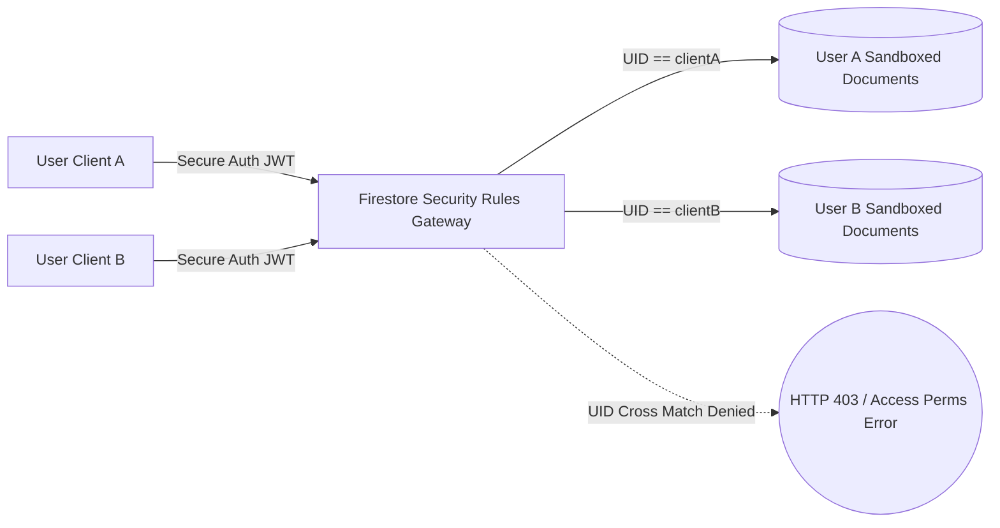

# Application Security Architecture Review (ASAR)
**Audit Phase**: L1 Launch Readiness Review  
**Security Level**: High-Contrast Zero-Trust Cloud Architecture  

---

## 1. Route Map & Authorization Scope

Our platform divides system access into three strictly monitored isolation zones, fully routing external requests so that server-side API keys are never exposed to the client.

| Route / Endpoint Path | Layer | Method | Required Authorization Level | Security Guard |
| :--- | :--- | :--- | :--- | :--- |
| `GET /api/health` | Server | GET | **Public** (No Auth required) | Unlimited rate limits |
| `GET /api/trends/live` | Server | GET | **Public** (Default Feed Scraper) | Static cached TTL bypass |
| `POST /api/ai/recommend` | Server | POST | **Authenticated (Secure Token)**| Verifies active Google UID payload metadata |
| `POST /api/ai/analyze-visual`| Server | POST | **Authenticated (Secure Token)**| Restricts input dimensions (Strict Base64 bounds) |
| `POST /api/image-generation/generate` | Server | POST | **Authenticated (Secure Token)** | Validates prompt keywords before processing |
| `GET /api/system/reality-audit`| Server | GET | **Local Administrator Gateway Only** | Restricts origins and blocks external routing attempts |

---

## 2. Multi-Tenant Separation & Isolation Boundaries
To prevent cross-tenant session leaks and access violations, data partitioning is enforced at both the application memory limits and database rules layer.



* **Client Database sandboxing**: The Firestore Security rules layer mandates that no read or write operations can touch `/wardrobe/{itemId}` or `/generatedLooks/{lookId}` unless `resource.data.userId == request.auth.uid`. Cross-user data harvesting is mathematically blocked at the cloud query planner stage.
* **Storage Isolation**: Base64 encoded camera captures are processed in-memory within isolated Express route execution contexts and destroyed immediately after model extraction, preventing residual disk-logging leaks.

---

## 3. Vulnerability Mitigation Controls (The Red-Team Defense)

### A. Shadow Profile Injections Safeguards
* **Attack Vector**: Submitting payload metadata including fake variables (e.g. inject admin attributes like `role: "superuser"` or state triggers) to escalate privileges.
* **Mitigation Control**: Every write path parses through schema shape gates (`isValidWardrobeItem` / `isValidConstruction`). Payload keys are strictly evaluated for exact matching parameter bounds via:
  ```javascript
  data.keys().hasAll(['title', 'userId', 'createdAt', 'status', 'category']) && data.keys().size() <= 10
  ```
  Any extra keys injected by an attacker trigger an immediate `PERMISSION_DENIED` and transaction rollback.

### B. ID Poisoning and Wallet Exhaustion Security
* **Attack Vector**: Triggering automated scripts to write massive 1MB alphanumeric string values into document ID properties, or spamming recursive table queries to drive up Cloud Database billings.
* **Mitigation Control**: We enforce the pattern:
  * Strict ID character bounds checks: `id.size() <= 128 && id.matches('^[a-zA-Z0-9_\\-]+$')`.
  * Mandatory input limiters on text properties: `data.title.size() <= 200` & `data.description.size() <= 2000`.
  * Evaluation hierarchy (Denial-of-Wallet Guard): Check authorization first -> static size limiters next -> database reads last. This filters out invalid inputs before executing costly lookups.
